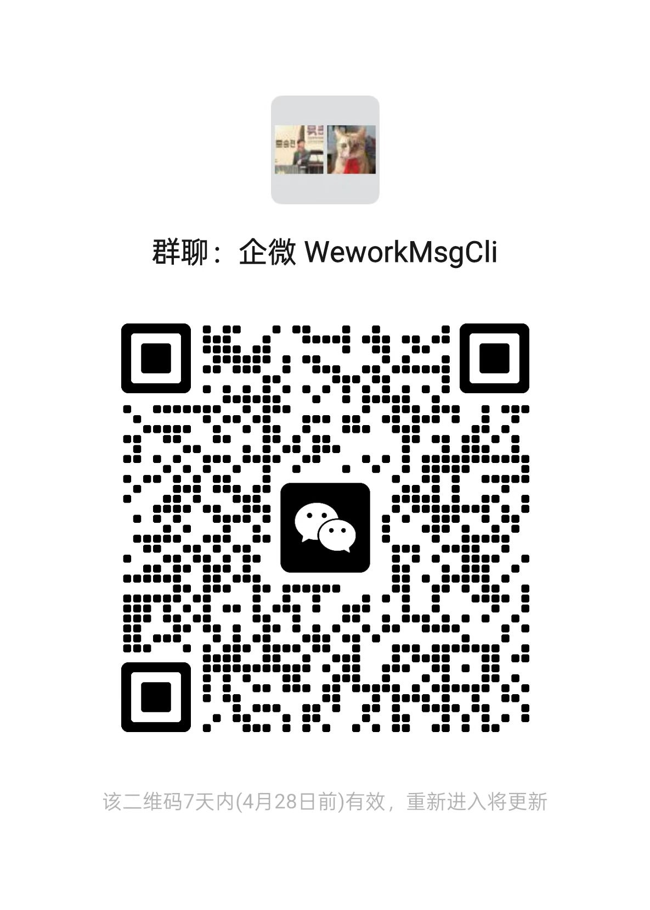

# WeworkMsgSdk
全语言通用的企业微信会话存档SDK

## 介绍

此项目基于 https://github.com/NICEXAI/WeWorkFinanceSDK 实现，采用 **服务端 + 客户端** 架构：

- **服务端 (WeworkMsg)**：部署在 Linux 服务器上，加载企微 SDK 动态库，对外暴露 HTTP 接口。负责与企微会话存档 API 通信、消息解密等底层操作。
- **客户端 (wework-cli)**：独立的命令行工具，跨平台支持 Linux/macOS/Windows。在本地运行，连接远程服务端调用接口。

开发者有两种使用方式：

| 方式 | 适用场景 |
|------|---------|
| **CLI 客户端** | 快速拉取消息、下载媒体文件、调试排查，一条命令搞定 |
| **HTTP 接口调用** | 集成到自己的业务系统中，支持 PHP/Python/Go 等任意语言 → [查看调用示例](HTTP_EXAMPLES.md) |

## 运行 Server

### 1. 下载文件

从 [Releases](https://github.com/Hanson/WeworkMsg/releases/) 下载最新版本，在服务器上准备好以下目录结构：

```
$ ls -la
total 24692
drwxr-xr-x  2 root root     4096 Apr 21 12:00 .
drwxr-xr-x 18 root root     4096 Apr 21 11:50 ..
-rw-r--r--  1 root root       69 Apr 21 12:00 .env
-rwxr-xr-x  1 root root 15335011 Apr 21 12:00 libWeWorkFinanceSdk_C.so
-rw-r--r--  1 root root      506 Apr 21 12:00 private_key.pem
-rwxr-xr-x  1 root root  8554112 Apr 21 12:00 WeworkMsg
```

### 2. 配置

编辑 `.env` 文件，填入企业的相关信息：

```
PORT=8888
CORP_ID=你的企业ID
CORP_SECRET=你的会话存档Secret
```

将 RSA 私钥内容粘贴到 `private_key.pem` 文件中。

### 3. 启动

```bash
# 设置动态链接库检索路径（选择其一即可）

# 方式一：复制到系统动态链接库目录
cp libWeWorkFinanceSdk_C.so /usr/lib/

# 方式二：在当前目录设置环境变量
export LD_LIBRARY_PATH=$(pwd)

# 启动服务
./WeworkMsg
```

服务启动后，默认监听 `http://localhost:8888`，提供以下接口：

| 接口 | 方法 | 说明 |
|------|------|------|
| `/get_chat_data` | POST | 获取会话消息列表 |
| `/get_media_data` | POST | 获取媒体文件数据 |

## CLI 客户端

### 安装

从 [Releases](https://github.com/Hanson/WeworkMsg/releases/) 下载对应平台的二进制文件：

| 文件 | 平台 |
|------|------|
| `wework-cli-linux-amd64` | Linux x86_64 |
| `wework-cli-darwin-amd64` | macOS Intel |
| `wework-cli-darwin-arm64` | macOS Apple Silicon |
| `wework-cli-windows-amd64.exe` | Windows x86_64 |

```bash
# Linux / macOS：添加执行权限
chmod +x wework-cli

# 可选：移动到 PATH 目录，方便全局使用
sudo mv wework-cli /usr/local/bin/

# Windows：直接使用 wework-cli-windows-amd64.exe，可重命名为 wework-cli.exe
```

自行编译（需要 Go 环境）：

```bash
make build-cli
```

验证安装：

```bash
wework-cli --version
# 输出: wework-cli version v0.1.0
```

### 配置服务端地址

CLI 需要知道 WeworkMsg 服务端的地址，有三种方式（优先级从高到低）：

```bash
# 方式一：命令行参数（推荐）
wework-cli chat --server http://192.168.1.100:8888

# 方式二：环境变量（适合脚本化或频繁使用）
export WEWORK_SERVER=http://192.168.1.100:8888
wework-cli chat  # 无需每次指定 --server

# 方式三：默认值 http://localhost:8888（服务端和 CLI 在同一台机器时）
wework-cli chat
```

| 参数 | 环境变量 | 默认值 | 说明 |
|------|---------|--------|------|
| `--server` | `WEWORK_SERVER` | `http://localhost:8888` | 服务端地址，flag 优先于环境变量 |

### chat — 拉取会话消息

从服务端拉取企微会话消息列表。

| 参数 | 类型 | 默认值 | 说明 |
|------|------|--------|------|
| `--seq` | uint | 0 | 消息 seq 起始值，首次拉取传 0，后续传入上次返回的最大 seq |
| `--limit` | uint | 100 | 单次拉取条数上限 |
| `--timeout` | int | 3 | 请求超时时间（秒） |
| `--proxy` | string | - | 代理地址 |
| `--passwd` | string | - | 代理密码 |
| `--output` | string | - | 输出到 JSON 文件，不指定则输出到终端 |

```bash
# 首次拉取
wework-cli chat --server http://192.168.1.100:8888

# 指定拉取条数
wework-cli chat --limit 50

# 续拉：传入上次返回的最大 seq
wework-cli chat --seq 12345

# 保存到文件
wework-cli chat --output messages.json

# 使用代理
wework-cli chat --proxy http://proxy:8080 --passwd yourpass
```

输出示例：
```json
[
  {
    "seq": 1,
    "msgid": "xxx",
    "publickey_ver": 1,
    "message": {
      "content": "你好",
      "from": "user1",
      "tolist": ["user2"]
    }
  }
]
```

### media — 下载媒体文件

从服务端下载企微会话中的媒体文件（图片、语音、视频等）。

| 参数 | 类型 | 必填 | 说明 |
|------|------|------|------|
| `--sdk-file-id` | string | 是 | 媒体文件 ID（从会话消息中获取） |
| `--timeout` | int | 否 | 超时时间（秒），默认 3 |
| `--proxy` | string | 否 | 代理地址 |
| `--passwd` | string | 否 | 代理密码 |
| `--output` | string | 否 | 保存到文件路径 |

```bash
# 下载媒体文件保存到本地
wework-cli media --sdk-file-id "xxxxxx" --output image.jpg

# 不指定 --output 时，输出 base64 编码内容到终端
wework-cli media --sdk-file-id "xxxxxx"
```

完整示例：拉取消息后下载图片

```bash
# 1. 拉取会话消息
wework-cli chat --output messages.json

# 2. 从 messages.json 中找到图片类型的 sdk_file_id

# 3. 下载图片
wework-cli media --sdk-file-id "找到的ID" --output photo.jpg
```

### 增量同步消息

记录每次返回的最大 seq 值，下次请求时传入即可实现增量拉取：

```bash
# 第一次拉取
wework-cli chat --seq 0 --output batch1.json
# 从输出中获取最大 seq，假设为 500

# 第二次拉取
wework-cli chat --seq 500 --output batch2.json
```

## HTTP 接口调用

服务端提供 HTTP 接口，可用任意语言调用，适合集成到业务系统中。

**接口说明：**

- `POST /get_chat_data` — 获取会话列表，参数 `{"seq":0,"limit":100,"timeout":3}`
- `POST /get_media_data` — 获取媒体文件，参数 `{"sdk_file_id":"xxx","timeout":3}`

**多语言调用示例：** [PHP / Python / Go →](HTTP_EXAMPLES.md)

## 加交流群



## 相关项目
* 开源scrm https://github.com/juhe-scrm/juhe-scrm
* 高级企微接口 https://github.com/hanson/vbot
* 聚合聊天 https://juhebot.com


